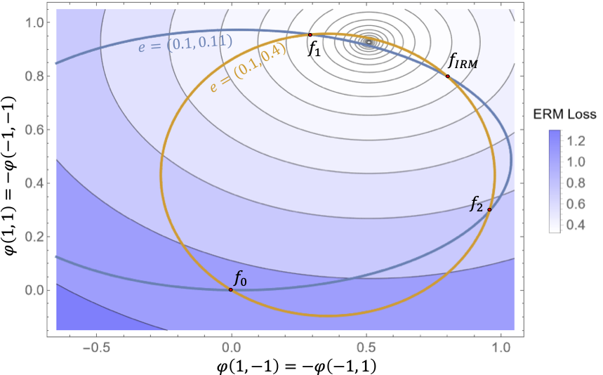
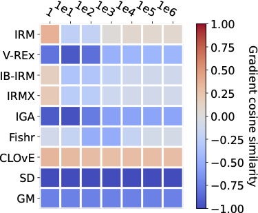
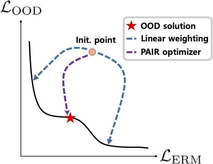
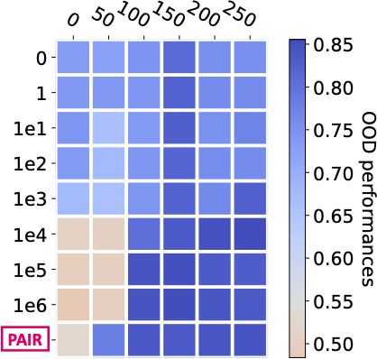

<h1 align="center">PAIR: Pareto Invariant Risk Minimization</h1>
<p align="center">
    <a href="https://arxiv.org/abs/2206.07766"></a>
    <a href="https://github.com/LFhase/PAIR"></a>
    <!-- <a href="https://colab.research.google.com/drive/1t0_4BxEJ0XncyYvn_VyEQhxwNMvtSUNx?usp=sharing"></a> -->
    <a href="https://openreview.net/forum?id=esFxSb_0pSL">  </a>
    <a href="https://github.com/LFhase/PAIR/blob/main/LICENSE">  </a>
    <!-- <a href="https://neurips.cc/virtual/2022/poster/54643"> </a> -->
    <!-- <a href="https://lfhase.win/files/slides/PAIR.pdf"> </a> -->
   <!--  <a href="https://icml.cc/media/PosterPDFs/ICML%202022/a8acc28734d4fe90ea24353d901ae678.png"> </a> -->
</p>

This repo contains the sample code for reproducing the results of our ICLR 2023: *[Pareto Invariant Risk Minimization](https://arxiv.org/abs/2206.07766)*, which has also been presented at [ICML PODS](https://sites.google.com/view/scis-workshop/home) Workshop. 😆😆😆

TODO items:

- [ ] Camera ready version of the paper <!-- [link](https://openreview.net/forum?id=esFxSb_0pSL)! -->
- [ ] Full instructions to reproduce results.

## Introduction
Recently, there has been a growing surge of interest in enabling machine learning systems to generalize well to Out-of-Distribution (OOD) data. Most efforts are devoted to advancing *optimization objectives* that regularize Empirical Risk Minimization (ERM) to capture the underlying invariance; however, little attention is paid to the *optimization process* of the objectives.
In fact, the optimization process of the OOD objectives turns out to be substantially more challenging than ERM.
When optimizing the ERM and OOD objectives,
$$\min_f (L_\text{ERM},L_\text{OOD})^T$$ 
there often exists an **<ins>optimization dilemma</ins>** in the training of the OOD objectives:
<p align="center">
  
  
  
  
</p>
<p align="center" style="font-size:8.5pt">
  <em>(a).</em> Theoretical failure case. &nbsp; &nbsp; &nbsp; &nbsp; &nbsp; &nbsp; &nbsp; &nbsp; &nbsp;
  <em>(b).</em> Gradient conflicts. &nbsp; &nbsp; &nbsp; &nbsp; &nbsp; &nbsp; &nbsp;
  <em>(c).</em> Unreliable Opt. Scheme. &nbsp; &nbsp; &nbsp; &nbsp; &nbsp; &nbsp; &nbsp;
  <em>(d).</em> Exhaustive tunning.
</p>


1. The original OOD objectives are often hard to be optimized directly (e.g., IRM), hence they are **<ins>relaxed as regularization terms</ins>** of ERM (e.g., IRMv1), i.e., $\min_f L_\text{ERM}+\lambda \widehat{L}\_\text{OOD}$, which can behave very differently and introduce huge gaps with the original one. As shown in figure *(a)*, the ellipsoids denote solutions that satisfy the invariance constraints of practical IRM variant IRMv1. When optimized with ERM, IRMv1 prefers $f_1$ instead of $f_\text{IRM}$ (The predictor produced by IRM).

2. The **<ins>intrinsic conflicts</ins>** between ERM and OOD objectives brings conflicts in gradients that further increases the optimization difficulty, as shown in figure *(b)*. Consequently, it often require careful tuning of the penalty weights (the $\lambda$). Figure (d) shows an example that IRMv1 usually requires exhaustive tuning of hyperparameters ($y$-axis: penalty weights; $x$-axis: ERM pre-training epochs before applying IRMv1 penalty),
Especially, the Multi-Objective Optimization (MOO) theory the typically used linear weighting scheme, i.e., $\min_f L_\text{ERM}+\lambda \widehat{L}\_\text{OOD}$ cannot reach any solutions in the non-convex part of the Pareto front, as shown in figure *(c)*, and lead to suboptimal OOD generalization performance.

3. Along with the optimization dilemma is another challenge, i.e., **<ins>model selection</ins>** during the training with the OOD objectives. As we lack the access to a validation set that have a similar distribution with the test data, <a href="https://github.com/facebookresearch/DomainBed">DomainBed</a> provides 3 options to choose and construct a validation set from: training domain data; leave-one-out validation data; test domain data. However, all three validation set construction approaches have their own limitations, as they essentially posit different **<ins> assumptions on the test distribution</ins>**.

This work provides understandings and solutions to the aforementioned challenges from the MOO perspective, which leads to a new optimization scheme for OOD generalization, called PAreto Invariant Risk Minimization (`PAIR`), including an optimizer `PAIR-o` and a new model selection criteria `PAIR-s`.

1. Owing to the MOO formulation, `PAIR-o` allows for **<ins>cooperative optimization</ins>** with other OOD objectives to improve the robustness of practical OOD objectives. Despite the huge gaps between IRMv1 and IRM, we show that incorporating VREx into IRMv1 (i.e., `IRMX` objective) provably recovers the causal invariance for some group of problem instances.
   
2. When given robust OOD objectives, `PAIR-o` finds a descent path with **<ins>adaptive penalty weights</ins>**, which leads to a Pareto optimal solution that trades off ERM and OOD performance properly, as shown in figure *(c)*. Therefore, `PAIR-o` robustly yields top performances and relieves the needs of exhaustive hyperparameter tunning, as shown in figure *(d)*. 

3. `PAIR-s` addresses the challenge of finding a proper validation set for model selection in OOD generalization, by leveraging **<ins>the prior assumed by the OOD objective</ins>**. Essentially, different lines of OOD algorithms adopt different priors and assumptions on the causes of the distribution shifts. The main purpose of the OOD evaluation is to validate the correctness of the posed assumptions. To this end, the selected models should properly reflect the preferences implied by the assumptions, i.e., the OOD loss values. When considering the loss values during the model selection, it is natural to leverage the MOO perspective and explicitly consider the trade-offs between ERM and OOD performance.

We conducted extensive experiments on challenging OOD benchmarks. Empirical results show that `PAIR-o` successfully alleviates the objective conflicts and empowers IRMv1 to achieve high performance in $6$ datasets from <a href="https://wilds.stanford.edu">WILDS</a>. `PAIR-s` effectively improves the performance of selected OOD models up to $10\%$ across $3$ datasets from <a href="https://github.com/facebookresearch/DomainBed">DomainBed</a>.

## Structure of Codebase

The whole code base contain four parts, corresponding to experiments presented in the paper:
- `Extrapolation`: Recovery of Causal Invariance
- `Extrapolation`: Proof of Concept on ColoredMNIST
- `WILDS`: Verification of PAIR-o in WILDS
- `DomainBed`: Verification of PAIR-s in DomainBed

## Recovery of Causal Invariance
We provide a minimal demo code for the experiments on the recovery of causal invariance, in [pair_extrapolation.ipynb](./pair_extrapolation.ipynb).


## ColoredMNIST
The corresponding code is in the folder [ColoredMNIST](./ColoredMNIST).
The code is modified from [RFC](https://github.com/TjuJianyu/RFC/).
To reproduce results of PAIR, simply run the following commands under the directory:

For the original ColoredMNIST data (CMNIST-25):
```
python run_exp.py  --methods pair  --verbose True --penalty_anneal_iters 150 --dataset coloredmnist025 --n_restarts 10 --lr 0.1 --opt 'test' 
```

For the modified ColoredMNIST data (CMNIST-01):
```
python run_exp.py  --methods pair  --verbose True --penalty_anneal_iters 150 --dataset coloredmnist01 --n_restarts 10 --lr 0.01 --opt 'test'
```

## WILDS
The corresponding code is in the folder [WILDS](./WILDS).
The code is modified from [Fish](https://github.com/YugeTen/fish).
The dependencies and running commands are the same as for [Fish](https://github.com/YugeTen/fish).
For example,
```
python main.py --need_pretrain --data-dir ./data --dataset civil --algorithm pair -pc 3 --seed 0 -ac 1e-4
```
We add additional commands to control `PAIR-p`:
- `-pc`: specify preferences;
- `--use_old`: to avoid repeated pretraining of ERM and directly use the pretrained weights;

To avoid negative loss inputs, we use the following commands to adjust IRMv1 loss values:
- `-al` and `-ac`: adjust negative irm penalties in pair by multiplying a negative number;
- `-ai`: adjust negative irm penalties in pair by adding up a sufficient large number;

We also provide a accelerated mode by freezing the featurizer by specifying `--frozen`.

Note that we use `wilds 2.0` following the latest official recommendations.


## DomainBed
The corresponding code is in the folder [DomainBed](./DomainBed).
The code is based on [DomainBed](https://github.com/facebookresearch/DomainBed).

We provide new [PAIR model selection criteria](./DomainBed/model_selection.py). 
Based on three options of validation set choice, we implement corresponding `PAIR-s` variants.

- `PAIRIIDAccuracySelectionMethod`: `PAIR-s` based on a random subset from the data of the training domains.
- `PAIRLeaveOneOutSelectionMethod`: `PAIR-s` based on a random subset from the data of a held-out (not training, not testing) domain.
- `PAIROracleSelectionMethod`: `PAIR-s` based on a random subset from the data of the test domain.

To use `PAIR-s`, simply add the corresponding functions or replace the original `model_selection.py` with ours,
and then run the corresponding commands in DomainBed.


## Misc

If you find our paper and repo useful, please cite our paper:

```bibtex
@inproceedings{pair,
title={Pareto Invariant Risk Minimization},
author={Yongqiang Chen and Kaiwen Zhou and Yatao Bian and Binghui Xie and Bingzhe Wu and Yonggang Zhang and Kaili Ma and Han Yang and Peilin Zhao and Bo Han and James Cheng},
booktitle={International Conference on Learning Representations},
year={2023},
url={https://openreview.net/forum?id=esFxSb_0pSL}
}
```
